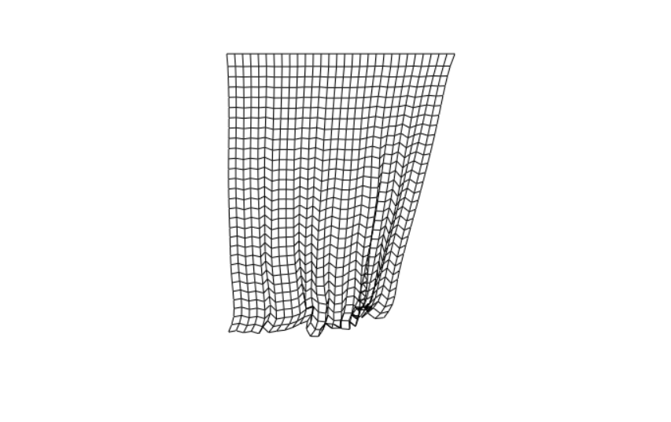

## Cloth Simulation
Simple cloth physics simulation with verlet integration. Verlet particle and verlet stick is combined to create cloth like structure.

  

## Tech Used
* Vanilla JS
* Canvas2D for rendering
